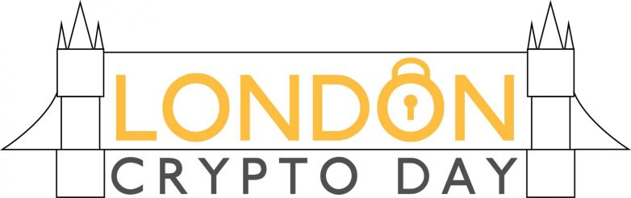

## What?

London Crypto Day is a full day of talks and discussion about cryptography.  The
event aims to provide interesting talk content, and create a space for
cryptographers and cryptography enthusiasts alike to come together and network
with like-minded people, who are either working or interested in similar areas
to themselves.

The event will include a selection of talks from both academia and industry, and
there will be plenty of time to socialize and network with other attendees.

## Where?

Google London, [6 Pancras Square, Kings Cross, London N1C 4AG](https://g.page/Google-UK-6PS?share)

## When?

Friday, 11th October 2019 at 10:00am

## Sounds great, I'm in!

Awesome! [RSVP here](https://docs.google.com/forms/d/e/1FAIpQLSdn4ts_2fAPmUJBnvpIsNYChrwOeiC7KYUn8DdmuvZ4VyZI2g/viewform)
to let us know you're coming.

## Speakers

* Gary Belvin, Google
* Evgenios Kornaropoulos, UC Berkeley
* James Bell, The Alan Turing Institute
* Phillipp Schoppmann, HIIG
* Katriel Cohn-Gordon, Facebook
* Will Shackleton, Facebook
* Olya Ohrimenko, Microsoft

## Agenda

09:30 - 10:00: 	**Arrival**  
10:00 - 10:10: 	**Welcome**

10:10 - 11:00:  James Bell, The Alan Turing Institute: *The Privacy Blanket of the Shuffle Model*  
11:00 - 11:50: 	Phillipp Schoppmann, HIIG: *Make Some ROOM for the Zeros: Data Sparsity in Secure Distributed Machine Learning*  
11:50 - 12:20: 	Will Shackleton, Facebook: *Facebook Over Tor*

12:20 - 13:20: 	**Lunch**

13:20 - 14:10: 	Gary Belvin, Google: *Key Transparency*  
14:10 - 15:00:  Evgenios Kornaropoulos, UC Berkeley: *Attacks on Encrypted Databases Beyond the Uniform Query Distribution*

15:00 - 15:20: 	**Coffee**

15:20 - 16:10: 	Olya Ohrimenko, Microsoft: *Differentially Private Algorithms for Trusted Execution Environments*  
16:10 - 16:40: 	Katriel Cohn-Gordon, Facebook: *Secure Messaging at Scale*

16:40 - 16:45: 	**Close**  
16:45 - 20:00:	**Happy hour(s)**

### Previous Events
* [March 2019](https://londoncryptoday19.splashthat.com/)
* [2017](https://londoncryptoday.wordpress.com/)

### Related Events
* [New York Crypto Day](https://nycryptoday.wordpress.com/)
* [Charles River Crypto Day](https://bostoncryptoday.wordpress.com/)
* [DC Area Crypto Day](https://dcareacryptoday.wordpress.com/)
* [Bay Area Crypto Day](https://bacrypto.github.io/)
* [Paris Crypto Day](https://pariscryptoday.github.io/)
* [Greater Tel Aviv Area Crypto Seminar](http://www.cs.tau.ac.il/cseminar/)
* [Tokyo Crypto Day](https://tokyocryptoday.github.io/index.html)
